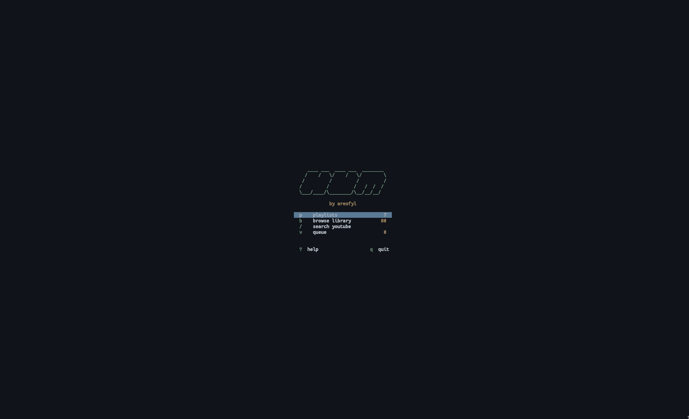

# Hum

Minimal TUI music player! Searches YouTube via yt-dlp, plays with mpv, and downloads tracks to a local library. No accounts and no bloat :)



## Dependencies

- [mpv](https://mpv.io) for playback
- [yt-dlp](https://github.com/yt-dlp/yt-dlp) for search and download
- ncurses

## Building

```
make
make install   # /usr/local/bin
```

## Usage

```
hum            # home screen
hum -p         # playlists
hum -b         # library
hum -s         # search
hum -q         # queue
```

Search for something on YouTube, play it, and hum downloads it to `~/Music/` in the background. Next time it plays the local file instead. Playlists are plain text files in `~/Music/playlists/` and saved with the `.hum` extension.

Search results show songs and playlists. You can expand a playlist to see its tracks, batch download everything, or just queue individual songs. Use `/` in any view to filter. Queue is persistent and saved between sessions.

## Keys

Vim-style :). `?` in the app shows all keybinds.

```
j/k         move
l, Enter    play / expand
Space       pause
n/p         next / prev
, .         seek 5s
+/-         volume
m           mute
r           repeat mode
a           add to queue
A           add to playlist
d           delete
c           clear queue
V           visual select
J/K         reorder queue
S           shuffle
s           save queue as playlist
R           rename playlist
D           batch download
/           filter
q, Esc      back
```

## Config

Configuration philosophy is suckless: edit `config.h` and rebuild. All keybinds, colors, library path, search count, volume, and seek step are configurable in `config.h`.

Build flags in `config.mk`. See `man hum` after installing for the full reference.

## License

[MIT](LICENSE)
